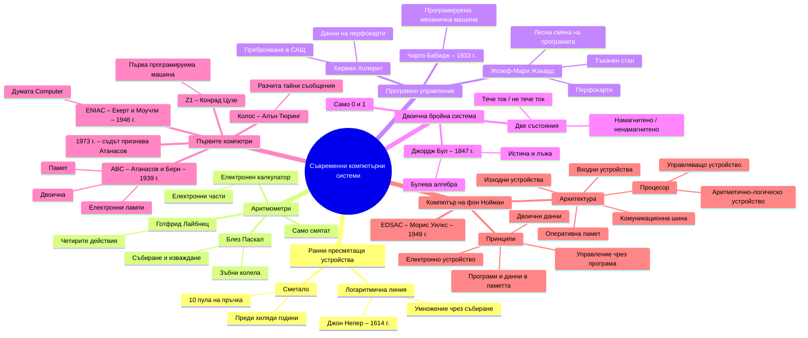

```mermaid
mindmap
  root((Съвременни компютърни системи))
    Ранни пресмятащи устройства
      Сметало
        Преди хиляди години
        10 пула на пръчка
      Логаритмична линия
        Джон Непер – 1614 г.
        Умножение чрез събиране
    Аритмометри
      Блез Паскал
        Зъбни колела
        Събиране и изваждане
      Готфрид Лайбниц
        Четирите действия
      Електронен калкулатор
        Електронни части
      Само смятат
    Програмно управление
      Жозеф-Мари Жакард
        Тъкачен стан
        Перфокарти
        Лесна смяна на програмата
      Чарлз Бабидж – 1833 г.
        Програмируема механична машина
      Херман Холерит
        Данни на перфокарти
        Преброяване в САЩ
    Двоична бройна система
      Само 0 и 1
      Две състояния
        Тече ток / не тече ток
        Намагнитено / ненамагнитено
      Джордж Бул – 1847 г.
        Булева алгебра
        Истина и лъжа
    Първите компютри
      Z1 – Конрад Цузе
        Първа програмируема машина
      ABC – Атанасов и Бери – 1939 г.
        Двоична
        Електронни лампи
        Памет
      Колос – Алън Тюринг
        Разчита тайни съобщения
      ENIAC – Екерт и Моучли – 1946 г.
        Думата Computer
      1973 г. – съдът признава Атанасов
    Компютър на фон Нойман
      Принципи
        Електронно устройство
        Двоични данни
        Управление чрез програма
        Програми и данни в паметта
      Архитектура
        Процесор
          Управляващо устройство
          Аритметично-логическо устройство
        Оперативна памет
        Входни устройства
        Изходни устройства
        Комуникационна шина
      EDSAC – Морис Уилкс – 1949 г.
```