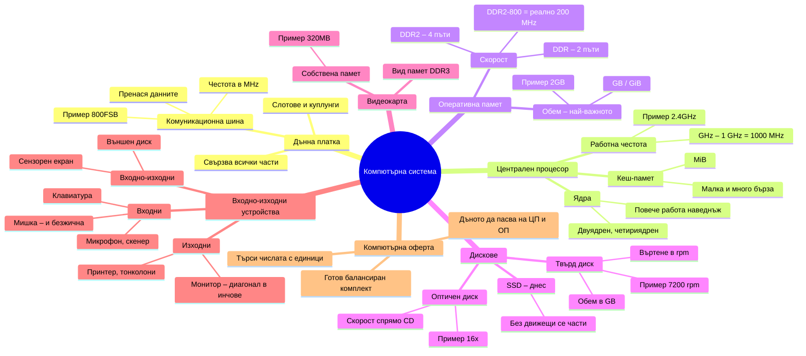

```mermaid
mindmap
  root((Компютърна система))
    Дънна платка
      Свързва всички части
      Комуникационна шина
        Пренася данните
        Честота в MHz
        Пример 800FSB
      Слотове и куплунги
    Централен процесор
      Работна честота
        GHz – 1 GHz = 1000 MHz
        Пример 2.4GHz
      Кеш-памет
        Малка и много бърза
        MiB
      Ядра
        Двуядрен, четириядрен
        Повече работа наведнъж
    Оперативна памет
      Обем – най-важното
        GB / GiB
        Пример 2GB
      Скорост
        DDR – 2 пъти
        DDR2 – 4 пъти
        DDR2-800 = реално 200 MHz
    Дискове
      Твърд диск
        Обем в GB
        Въртене в rpm
        Пример 7200 rpm
      Оптичен диск
        Скорост спрямо CD
        Пример 16x
      SSD – днес
        Без движещи се части
    Видеокарта
      Собствена памет
        Пример 320MB
      Вид памет DDR3
    Входно-изходни устройства
      Входни
        Клавиатура
        Мишка – и безжична
        Микрофон, скенер
      Изходни
        Монитор – диагонал в инчове
        Принтер, тонколони
      Входно-изходни
        Сензорен екран
        Външен диск
    Компютърна оферта
      Готов балансиран комплект
      Търси числата с единици
      Дъното да пасва на ЦП и ОП
```