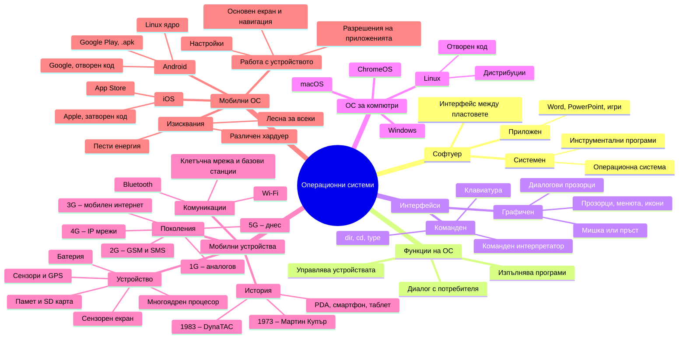

```mermaid
mindmap
  root((Операционни системи))
    Софтуер
      Системен
        Операционна система
        Инструментални програми
      Приложен
        Word, PowerPoint, игри
      Интерфейс между пластовете
    Функции на ОС
      Изпълнява програми
      Диалог с потребителя
      Управлява устройствата
    Интерфейси
      Графичен
        Прозорци, менюта, икони
        Диалогови прозорци
        Мишка или пръст
      Команден
        Команден интерпретатор
        dir, cd, type
        Клавиатура
    ОС за компютри
      Windows
      macOS
      Linux
        Дистрибуции
        Отворен код
      ChromeOS
    Мобилни устройства
      История
        1973 – Мартин Купър
        1983 – DynaTAC
        PDA, смартфон, таблет
      Поколения
        1G – аналогов
        2G – GSM и SMS
        3G – мобилен интернет
        4G – IP мрежи
        5G – днес
      Комуникации
        Клетъчна мрежа и базови станции
        Wi-Fi
        Bluetooth
      Устройство
        Сензорен екран
        Многоядрен процесор
        Памет и SD карта
        Сензори и GPS
        Батерия
    Мобилни ОС
      Изисквания
        Пести енергия
        Различен хардуер
        Лесна за всеки
      Android
        Google, отворен код
        Linux ядро
        Google Play, .apk
      iOS
        Apple, затворен код
        App Store
      Работа с устройството
        Основен екран и навигация
        Настройки
        Разрешения на приложенията
```
