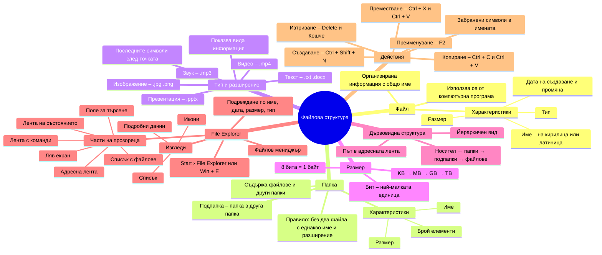

# Урок 5 – Файлова структура на организация на данните

```mermaid
mindmap
  root((Файлова структура))
    Файл
      Организирана информация с общо име
      Използва се от компютърна програма
      Характеристики
        Име – на кирилица или латиница
        Тип
        Дата на създаване и промяна
        Размер
    Папка
      Съдържа файлове и други папки
      Характеристики
        Име
        Брой елементи
        Размер
      Подпапка – папка в друга папка
      Правило: без два файла с еднакво име и разширение
    Тип и разширение
      Показва вида информация
      Последните символи след точката
      Текст – .txt .docx
      Изображение – .jpg .png
      Звук – .mp3
      Видео – .mp4
      Презентация – .pptx
    Размер
      Бит – най-малката единица
      8 бита = 1 байт
      KB → MB → GB → TB
    Дървовидна структура
      Йерархичен вид
      Носител → папки → подпапки → файлове
      Път в адресната лента
    File Explorer
      Файлов мениджър
      Start › File Explorer или Win + E
      Части на прозореца
        Ляв екран
        Адресна лента
        Лента с команди
        Списък с файлове
        Поле за търсене
        Лента на състоянието
      Изгледи
        Икони
        Списък
        Подробни данни
      Подреждане по име, дата, размер, тип
    Действия
      Създаване – Ctrl + Shift + N
      Копиране – Ctrl + C и Ctrl + V
      Преместване – Ctrl + X и Ctrl + V
      Преименуване – F2
      Изтриване – Delete и Кошче
      Забранени символи в имената
```
