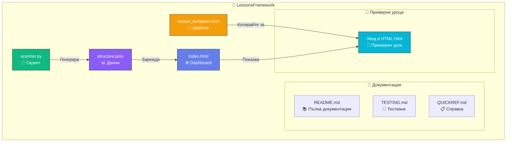
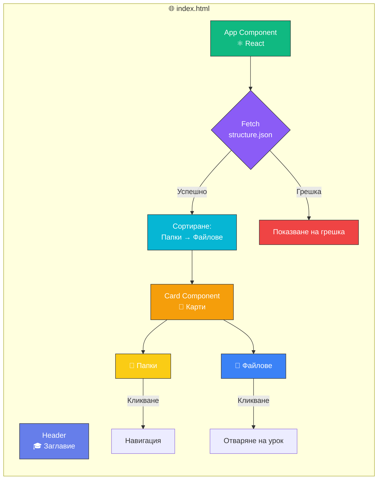
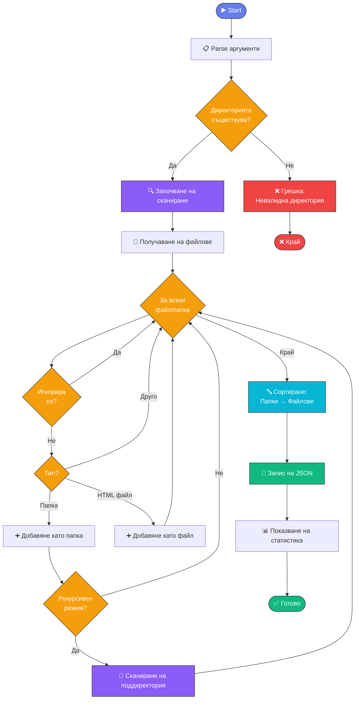

# 🔄 Работен процес - Визуализация

## Диаграма на работния процес

```mermaid
flowchart TD
    Start([🚀 Започнете тук]) --> Check{Имате ли<br/>съдържание?}
    
    Check -->|Не| CreateFolder[📁 Създайте папка<br/>mkdir "Тема"]
    Check -->|Да| Scan
    
    CreateFolder --> CopyTemplate[📋 Копирайте шаблон<br/>copy lesson_template.html]
    CopyTemplate --> EditLesson[✏️ Редактирайте урока<br/>code урок.html]
    EditLesson --> Scan
    
    Scan[🔍 Сканирайте<br/>python scanner.py -r] --> Generate[📊 Генериране на<br/>structure.json]
    Generate --> Open[🌐 Отворете в браузър<br/>start index.html]
    
    Open --> View{Изглежда<br/>добре?}
    View -->|Не| Edit[✏️ Редактирайте]
    Edit --> Scan
    
    View -->|Да| Publish{Публикувате<br/>ли?}
    Publish -->|Не| Done([✅ Готово!])
    Publish -->|Да| Deploy[🚀 Публикувайте<br/>GitHub Pages / Netlify]
    Deploy --> Done
    
    style Start fill:#667eea,stroke:#333,color:#fff
    style Done fill:#10b981,stroke:#333,color:#fff
    style Check fill:#f59e0b,stroke:#333,color:#fff
    style View fill:#f59e0b,stroke:#333,color:#fff
    style Publish fill:#f59e0b,stroke:#333,color:#fff
    style Scan fill:#8b5cf6,stroke:#333,color:#fff
    style Generate fill:#8b5cf6,stroke:#333,color:#fff
    style CreateFolder fill:#3b82f6,stroke:#333,color:#fff
    style CopyTemplate fill:#3b82f6,stroke:#333,color:#fff
    style EditLesson fill:#3b82f6,stroke:#333,color:#fff
    style Open fill:#06b6d4,stroke:#333,color:#fff
    style Edit fill:#ec4899,stroke:#333,color:#fff
    style Deploy fill:#10b981,stroke:#333,color:#fff
```

## Структура на системата



## Компоненти на Dashboard



## Логика на scanner.py



## Структура на lesson template

```mermaid
graph TB
    subgraph "📄 lesson_template.html"
        A[HTML DOCTYPE]
        B[HEAD<br/>Meta, Fonts, Icons, Styles]
        C[BODY]
        
        C --> D[Container]
        D --> E[Header<br/>🎨 Градиент с анимация]
        D --> F[Content<br/>📝 Съдържание на урока]
        D --> G[Footer<br/>ℹ️ Copyright]
        
        F --> H[Заглавия h2, h3]
        F --> I[Параграфи]
        F --> J[Списъци ul, ol]
        F --> K[Код pre, code]
        F --> L[Highlight Box<br/>💡 Важни бележки]
        F --> M[Бутон "Назад"<br/>🔙 Към Dashboard]
    end
    
    style A fill:#667eea,stroke:#333,color:#fff
    style B fill:#8b5cf6,stroke:#333,color:#fff
    style C fill:#10b981,stroke:#333,color:#fff
    style D fill:#06b6d4,stroke:#333,color:#fff
    style E fill:#f59e0b,stroke:#333,color:#fff
    style F fill:#3b82f6,stroke:#333,color:#fff
    style G fill:#6b7280,stroke:#333,color:#fff
    style M fill:#ec4899,stroke:#333,color:#fff
```

---

**Използвайте тези диаграми за по-добро разбиране на системата! 🎨**
